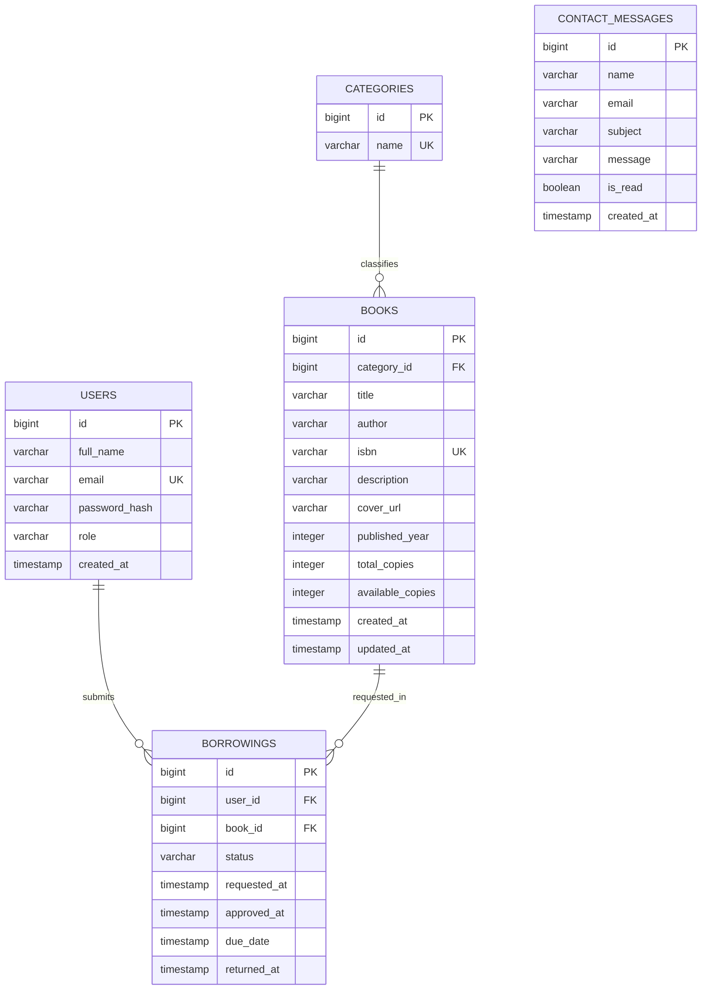

# Library Management System — ERD



## Relationships

- One category can contain many books.
- One user can submit many borrowing requests.
- One book can appear in many borrowing records over time.
- Contact messages are independent records reviewed by an administrator.

## Borrowing status flow

```text
PENDING ──> APPROVED ──> RETURNED
   └──────> REJECTED
```
